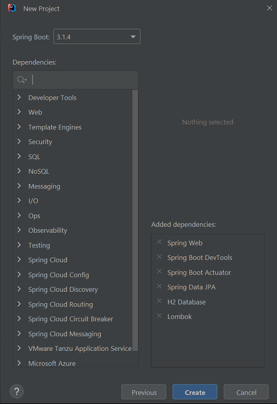
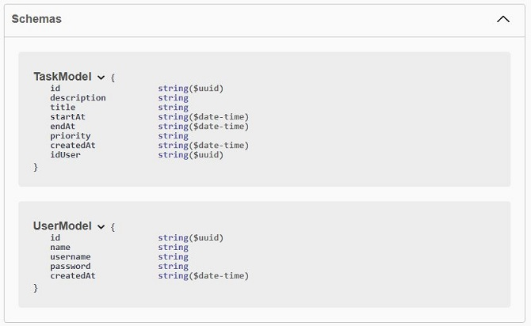
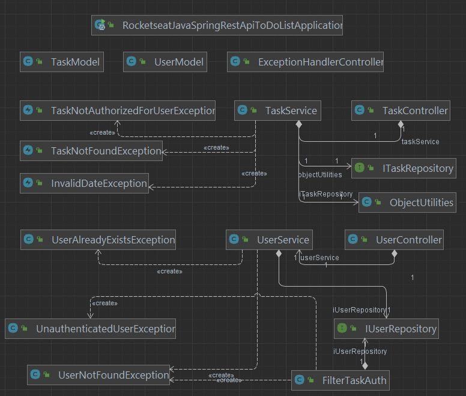
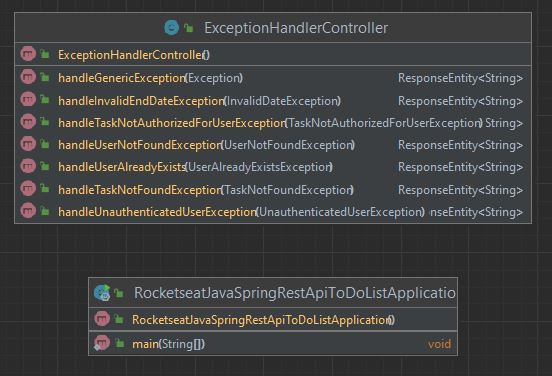
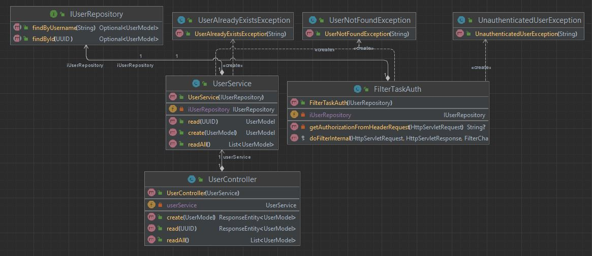
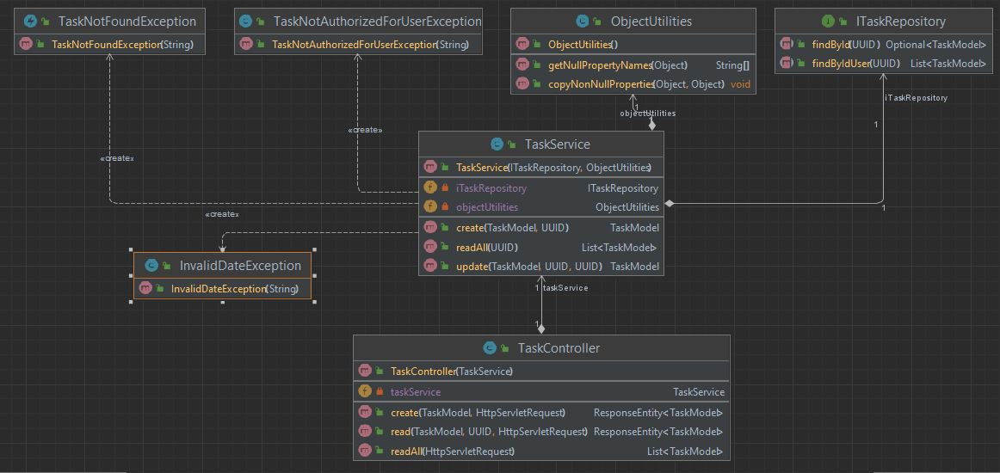

# Rocketseat - Java - REST API com Spring Framework.
Projeto do curso de Java da Rocketseat em Setembro de 2023. 
Criação de uma API REST com Spring Framework.

## Inicializador do Projeto

## Recursos e rotas da API

Para acessar o Swagger: http://localhost:8080/swagger-ui.html

A autenticação é passada como parâmetro `credentials` no Header com valor `username:password`.

Para acessar o banco de dados 2:
- http://localhost:8080/h2
- login: `admin`;
- senha: `admin`.

## Diagramas de Classes - UML

## Certificado

