# Rocketseat - Java - REST API with Spring Framework.
Rocketseat Java course project in September 2023.
Creation of a REST API with Spring Framework.

## Project Starter

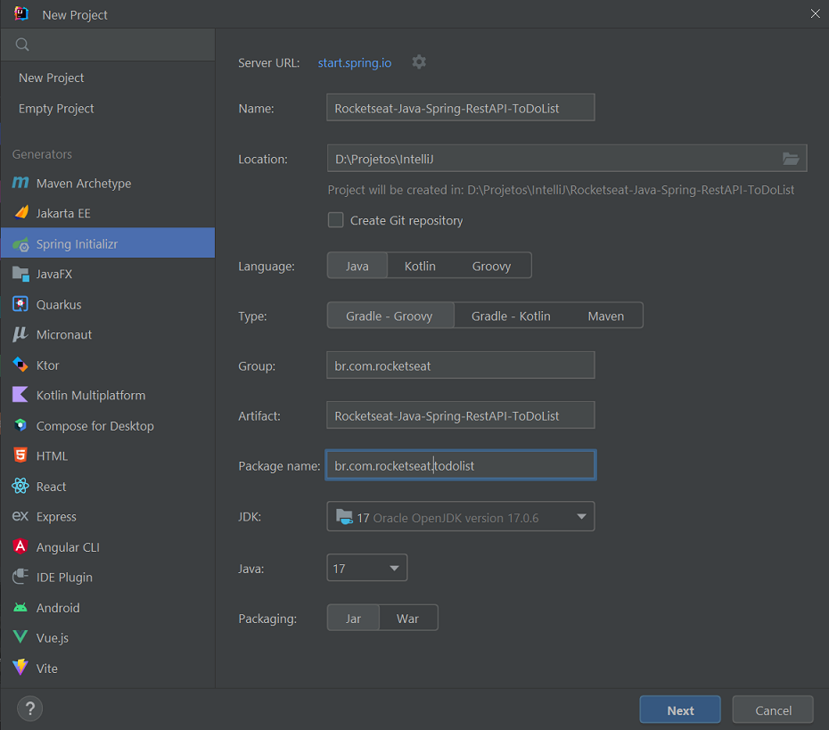

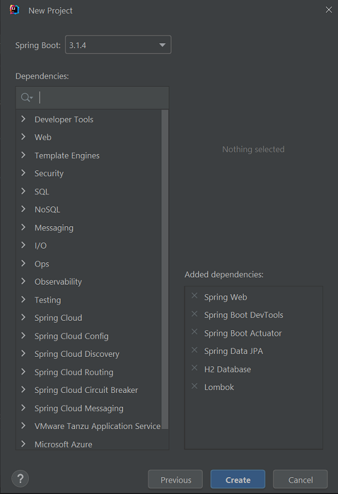

## API Resources and Routes

To access Swagger: http://localhost:8080/swagger-ui.html

Authentication is passed as a `credentials` parameter in the Header with a value of `username:password`.

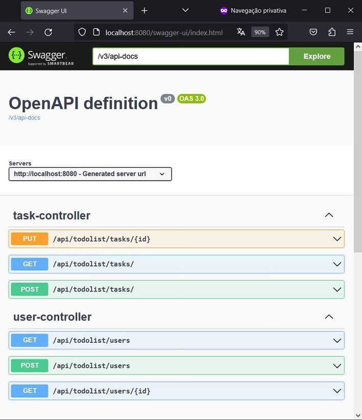

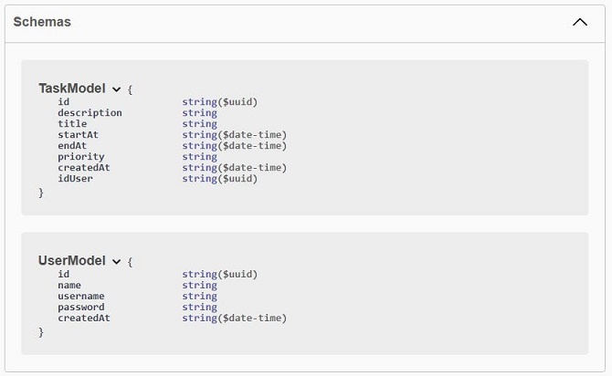

To access h2 database:
- http://localhost:8080/h2
- login: `admin`;
- password: `admin`.

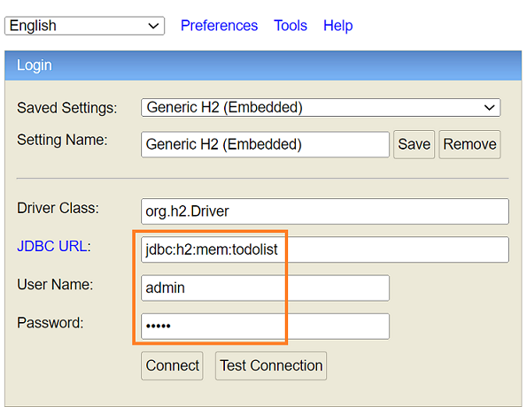

## Class Diagrams - UML

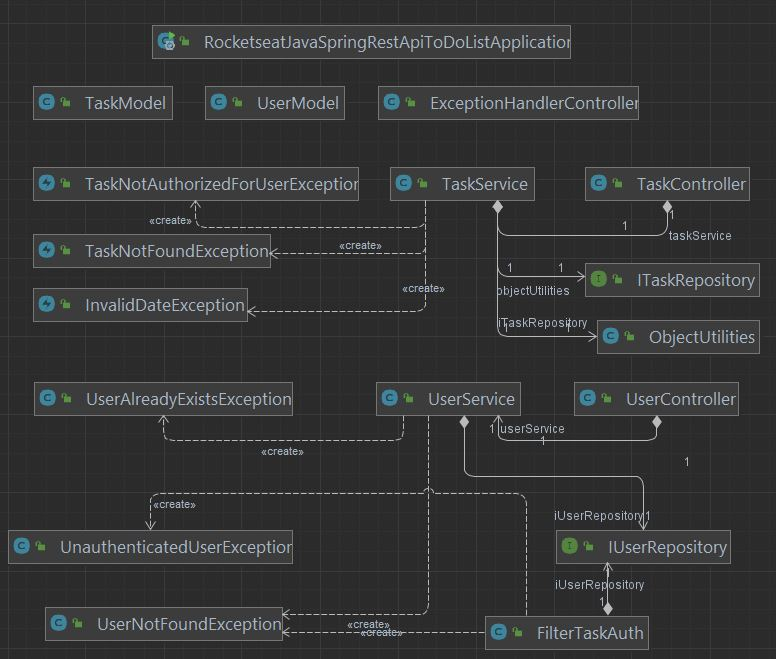

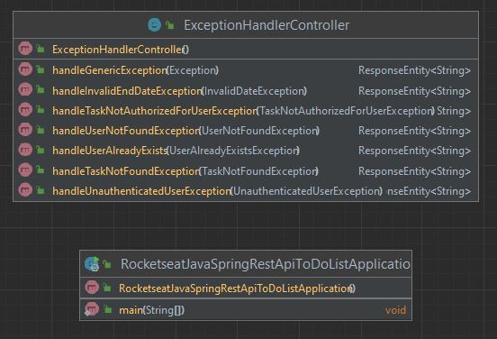

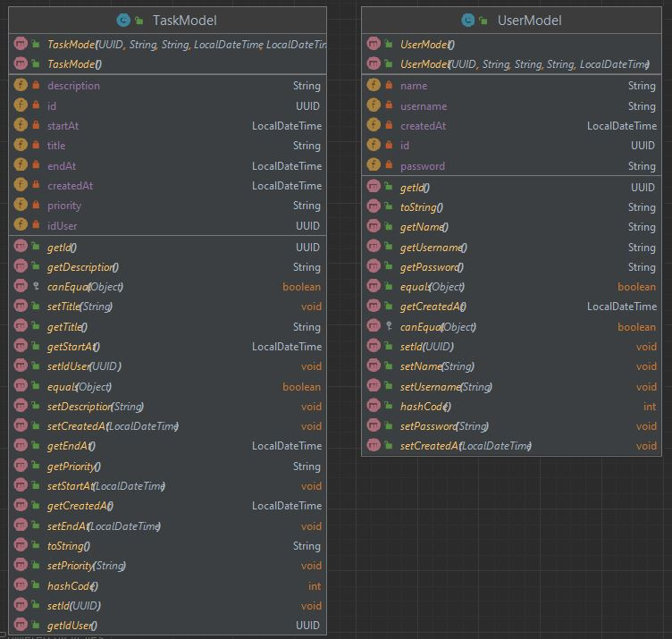

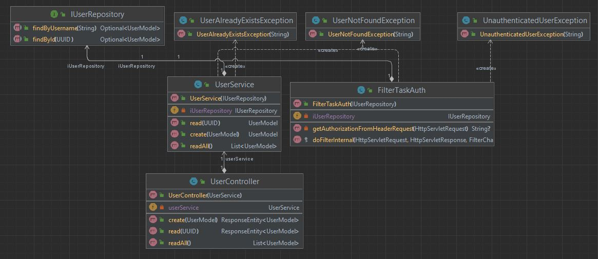

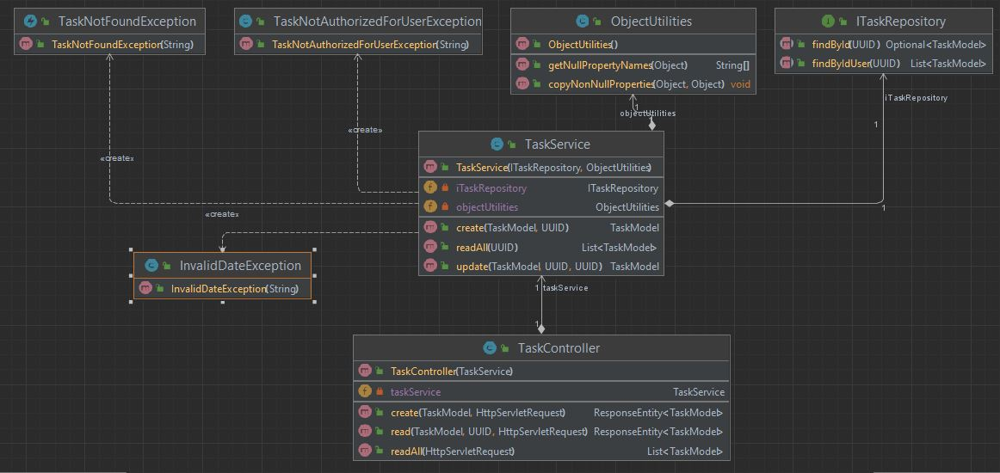

## Certificate

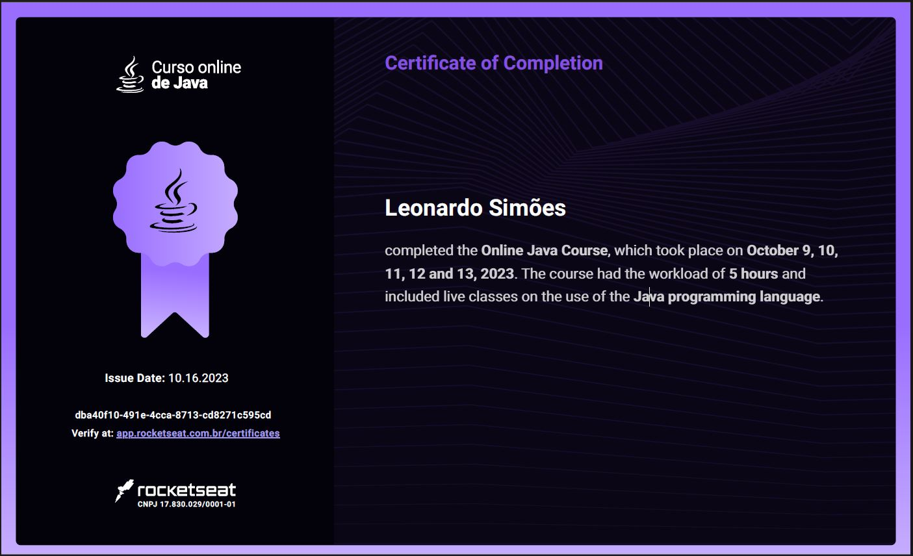